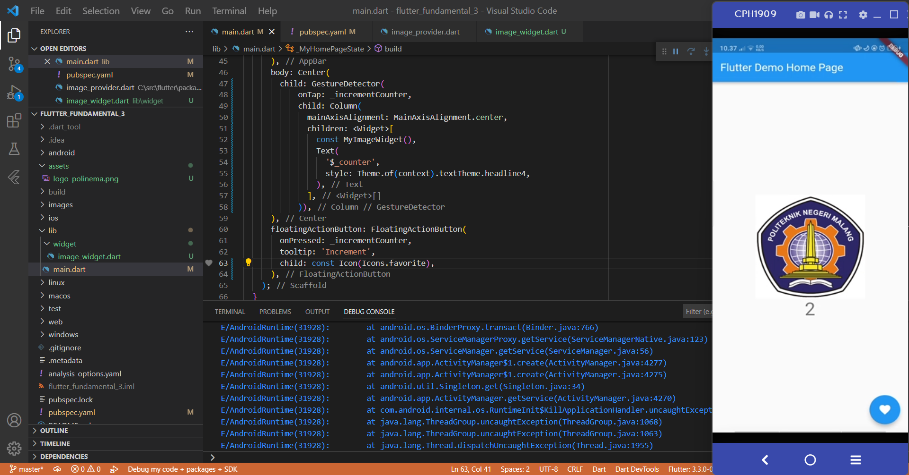
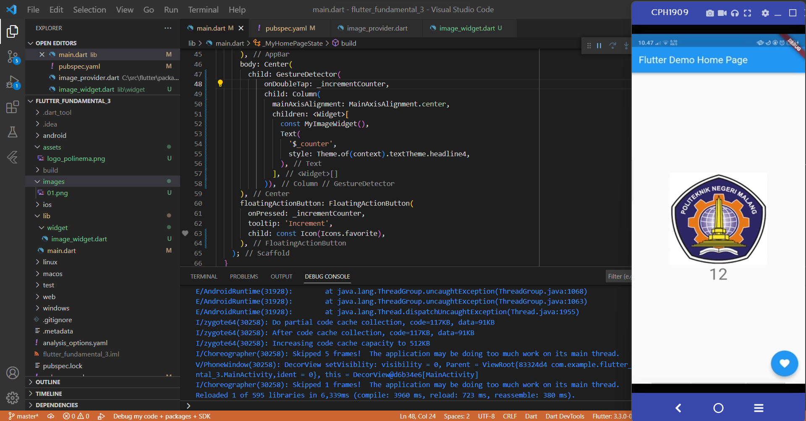
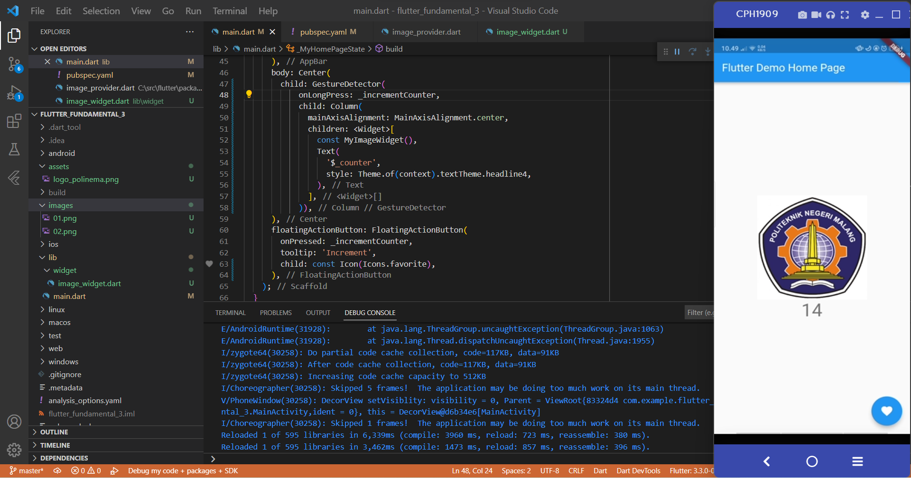
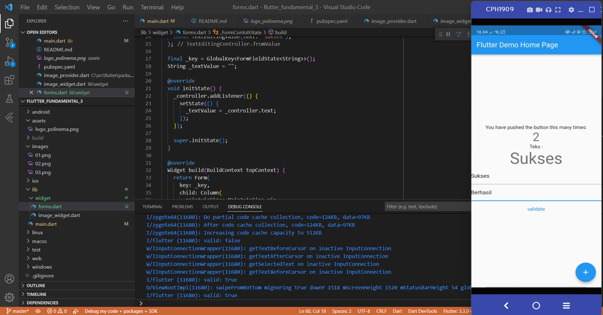

# flutter_fundamental_3

Praktikum hari 17 Flutter

## Praktikum 1: Menerapkan Gesture Detector

### onTap

Pada praktikum bagian ini, onTap berfungsi apabila kita menekan gambar. onTap disini sama dengan click. Fungsi onTap sendiri apabila setiap kita meng-klik gambar 1x maka angka akan bertambah 1. 

### onDoubleTap

Fungsi dari onDoubleTap hampir sama dengan onTap. Akan tetapi perbedaannya terdapat saat kita klik gambar. onDoubleTap memiliki arti apabila kita klik gambar 2x maka angka akan bertambah 1. 

### onLongPress

Fungsi dari onLongPress mirip dengan onTap maupun onDoubleTap. Tetapi, perbedaannya apabila onLongPress berfungsi saat kita menekan gambar cukup lama. Setelah itu fungsi increment akan berjalan. Dalam onLongPress ini kita menekan gambar kurang lebih 2-3 detik.

## Praktikum 2: Menerapkan Input Widget dan Forms

Pada praktikum ini, kita diajarkan untuk membuat form input dan juga memberikan validasi pada form nya. Disini, untuk form input yang pertama diberi validasi apabila form kosong atau tidak ada isi maka akan muncul pesan bahwa form tidak boleh kosong.